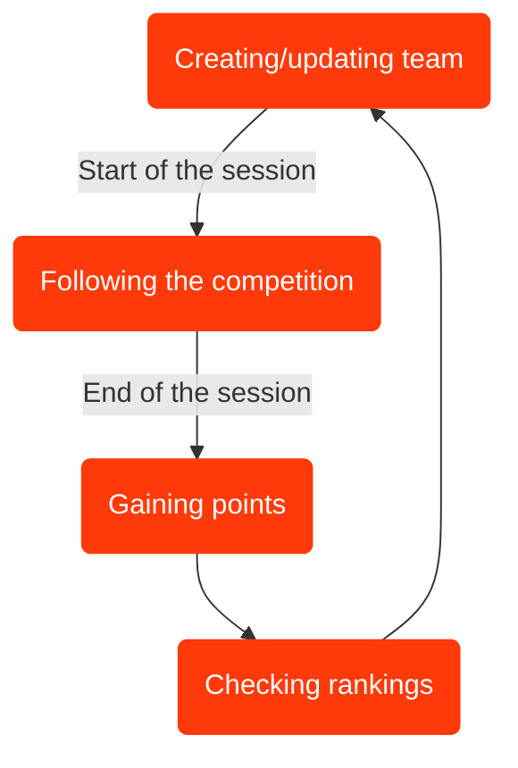

***FanAthletics*** is a mobile and web application for following athletics competitions and competing in fantasy sports games related to them. Fans can build up their own teams of real athletes, gain points based on their performance and compete in rankings with other players and AI rival. Moreover, they can keep track of all the action happening during the competition.

## What can you do?

We distinguish between two types of users: *fans/players* and *administrators*. Here is what they can do:

👑 **Administrators:**
* create athletics events that gather the data from external APIs,
* manage events, athletes and disciplines,
* create fantasy games.

👥 **Fans/players:** *a fan becomes a player when they join the game by creating a team*
* 🍿 **Fans:**
  * check the schedule of the event,
  * keep track of the results of competitions,
  * browse disciplines and athletes info (including personal records and season bests).  
* 🏆 **Players:**
  * create teams composed of real athletes,
  * modify the teams between sessions of the event,
  * compete in leaderboards with other players and AI rival.

## How it works?
### 🛡️ Authentication
Users can register and log in using one of three ways:
* by [Google](https://google.com),
* by [Facebook](https://facebook.com),
* using magic link mechanism.
### 📆 Creating events
Administrators create athletic events by connecting to an API provided by [domtel-sport](https://domtel-sport.pl), the company which handles the technical organization (e.g. results management, time measurement systems) of the biggest competitions in Poland - including national championships and international meetings. The API provides start lists and livetime results, as well as the event schedule and basic info about it. The app process these results in real-time to give users continuous and fastest possible access to them.

### 🔍 Athletes data
To gain data about athletes participating in the event, we implemented a python scraper that is launched when the event is created. The most important stats that are downloaded are personal records and season bests of an athlete - these are used to determine the cost of this athlete in the fantasy game and to help players choose the best athletes for their team.

### 🎮🎴 Fantasy game
Administrators can activate the fantasy game for a chosen event. This allows fans to build their own teams composed of real athletes. Player has a specified budget for creating the team. Every athlete has a cost which is based on their win predictions in disciplines they compete in. These predictions are determined using Gumbel-top-*k* trick algorithm and Plackett-Luce distribution, which utilise personal records and season bests of athletes.

🦸 **Captain privilege:** *Every player has a possibility of choosing a captain of their team. Team captains score double points!*

When the competition in chosen discipline is finished, the athletes score points for the player's team. Points are awarded for the final position and result (e.g. time of run or height of jump) of the athlete. Points for the result are calculated based on World Athletics scoring tables.

During the game you can check, how your team compares to other players' teams in rankings.

🧠 **AI rival:** *Players compete with a team chosen by AI model provided by [Google Gemini API](https://ai.google.dev/gemini-api/docs).*

The cycle of fantasy game rounds can be illustrated as:


## How to use

Run the following command:

```sh
pnpm install
```

```sh
pnpm prepare
```

```sh
docker compose up
```

To start API server:

```sh
pnpm dev:api
```

To start Web App:

```sh
pnpm dev:web
```

To start scraper server:

```sh
pnpm dev:scrap
```

To start iOS App:

```sh
pnpm dev:ios
```

To reset Database:

```sh
cd packages/database
pnpm db:reset
```

## What's inside?

This repository includes the following packages/apps:

### Apps and Packages

- `api`: a [node.js](https://nodejs.org/) app built with
  [Hono](https://hono.dev/)
- `platform`: a [react-native](https://reactnative.dev/) app built with
  [expo](https://docs.expo.dev/)
- `scraper`: a [python](https://www.python.org/) scraper build with [Express](https://expressjs.com/)

`api` and `platform` packages/apps are 100% [TypeScript](https://www.typescriptlang.org/).

### Utilities

This repository has some additional tools already setup for you:

- [Expo](https://docs.expo.dev/) for native development
- [TypeScript](https://www.typescriptlang.org/) for static type checking
- [Biome](https://biomejs.dev/) for code formatting


## Authors
* [Eryk Hadała](https://github.com/Ericfgm)
* [Szymon Paja](https://github.com/pajka1sz)
* [Tomasz Paja](https://github.com/pajka2T)

---

<p align="center">
  
</p>
